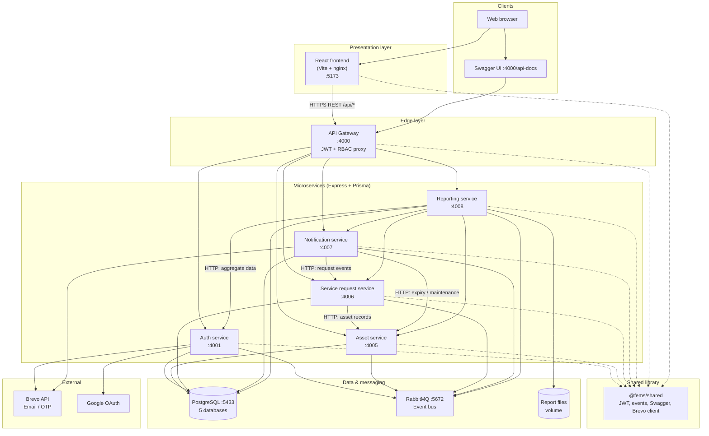
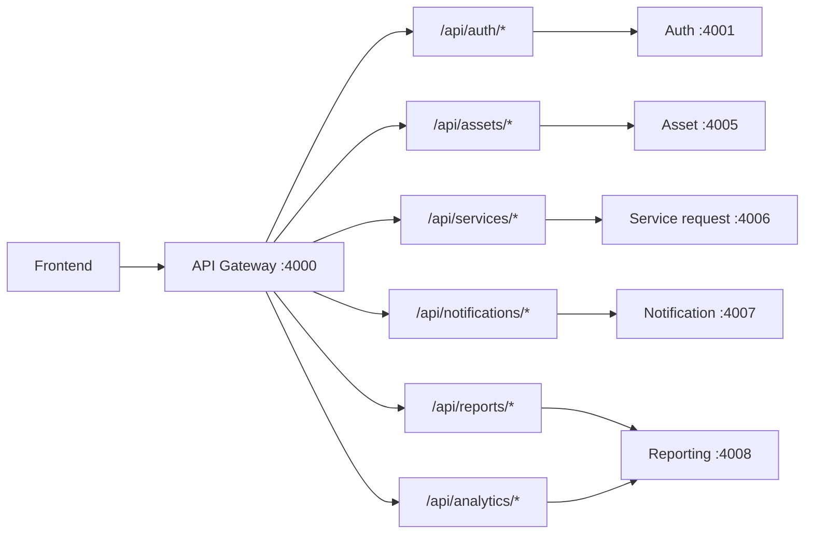
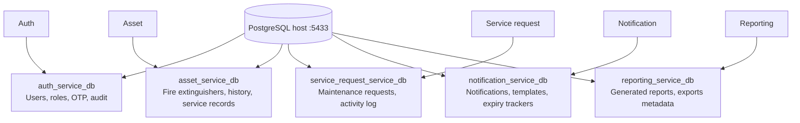
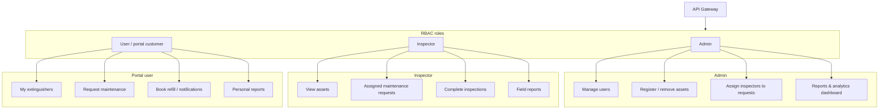
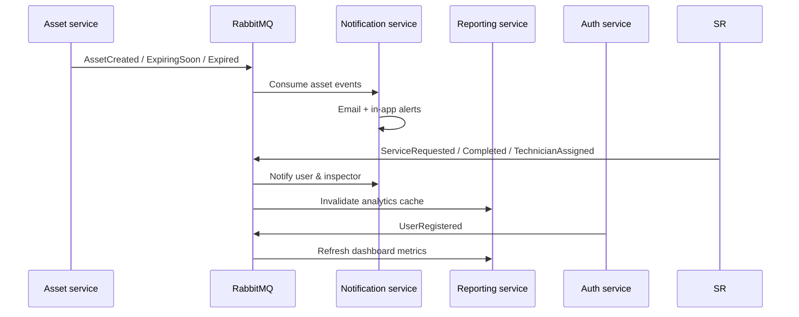

# FEMS System Architecture (TWZ LTD)

Fire Extinguisher Management System — technical architecture as implemented in this repository.

## High-level architecture

## API gateway routing

## Databases (database-per-service)

## Roles and main flows

## Event-driven integration (RabbitMQ)

## Component summary

| Layer | Component | Port | Responsibility |
|--------|-----------|------|----------------|
| UI | React frontend | 5173 | Admin, Inspector, User portals |
| Edge | API gateway | 4000 | Single API, JWT, role guards, Swagger |
| Service | Auth | 4001 | Signup/login, OTP, users, JWT |
| Service | Asset | 4005 | Extinguisher CRUD, expiry cron, serial numbers |
| Service | Service request | 4006 | Maintenance workflow, assignment, audit trail |
| Service | Notification | 4007 | Email (Brevo), in-app, expiry/compliance crons |
| Service | Reporting | 4008 | KPIs, report generation, PDF/CSV/XLSX export |
| Data | PostgreSQL | 5433 | 5 isolated service databases |
| Messaging | RabbitMQ | 5672 / 15672 | Async domain events |
| External | Brevo | — | Transactional email |
| Shared | `@fems/shared` | — | Types, middleware, events, OpenAPI helpers |

## Design principles

1. **Database per service** — No cross-DB foreign keys; links use UUIDs (`userId`, `customerId`, `assetId`).
2. **Gateway as single public API** — Frontend only talks to `:4000/api`.
3. **Sync HTTP for reads/writes** — Reporting and notifications call other services with forwarded user headers.
4. **Async events for side effects** — Expiry alerts, cache invalidation, and notifications via RabbitMQ.
5. **Portal scope** — Portal users are scoped by `customerId` (typically their own `userId`).

## Related documentation

- [ENVIRONMENT.md](./ENVIRONMENT.md) — Environment variables and service URLs
- [API_DOCS.md](./API_DOCS.md) — Swagger UI and OpenAPI
- [AUDIT.md](./AUDIT.md) — Implementation audit and gaps
