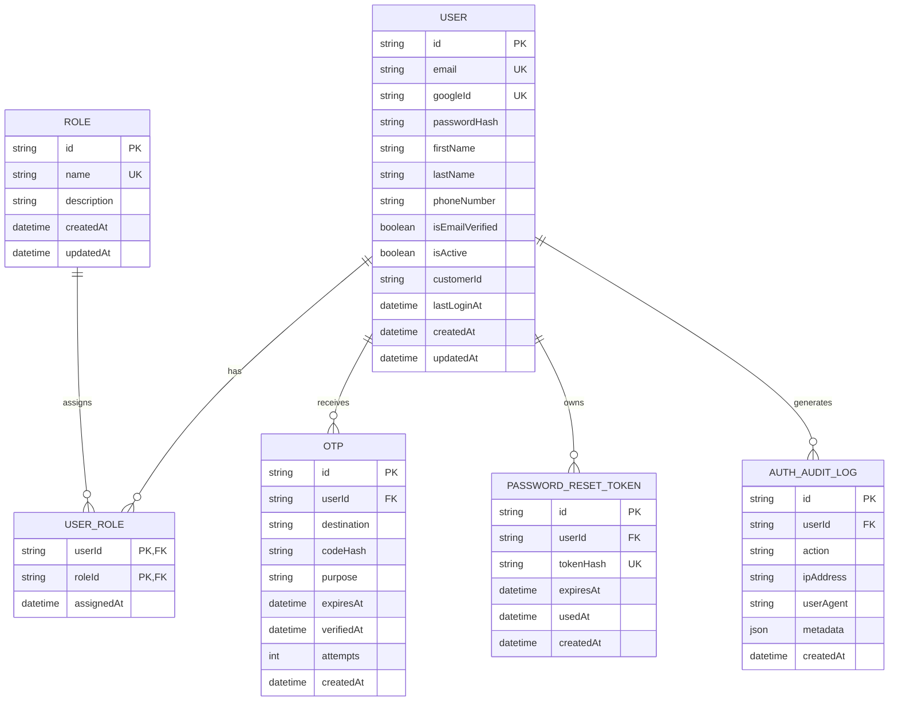
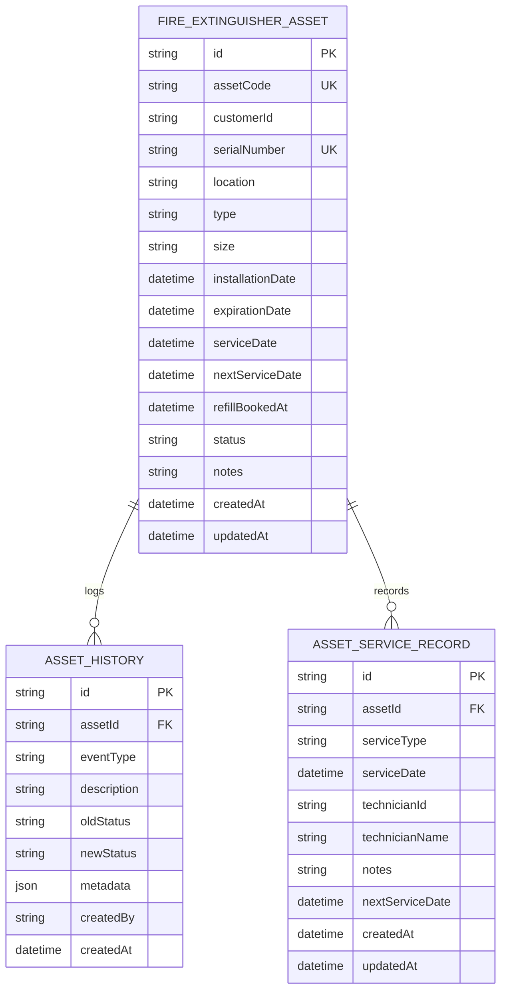
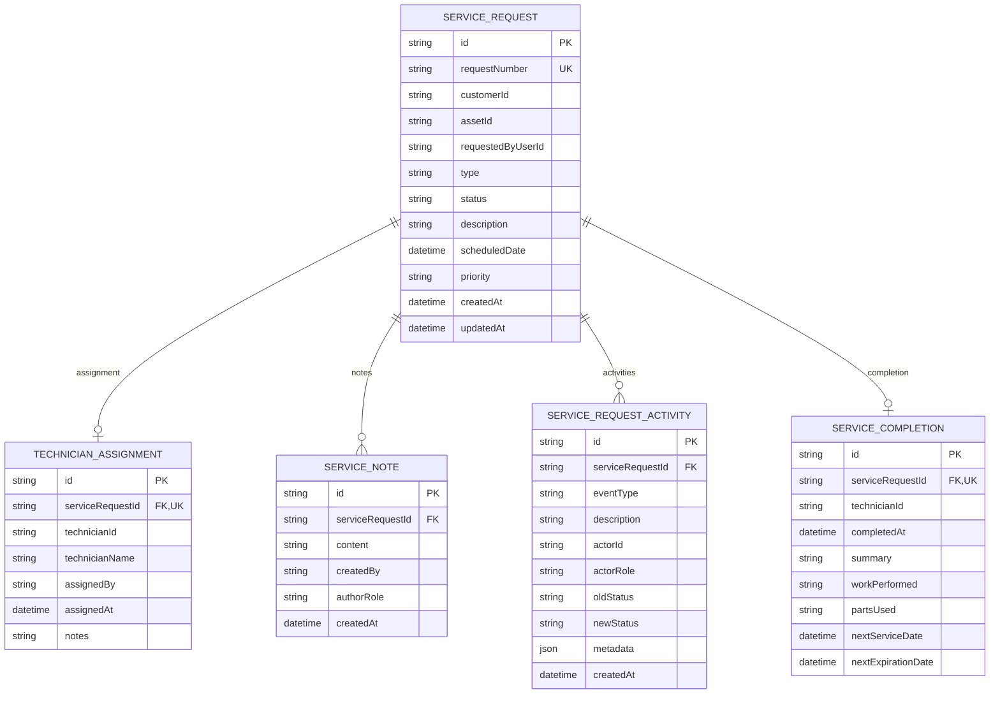
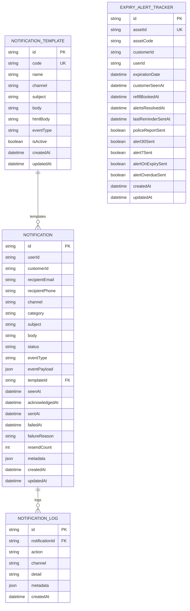
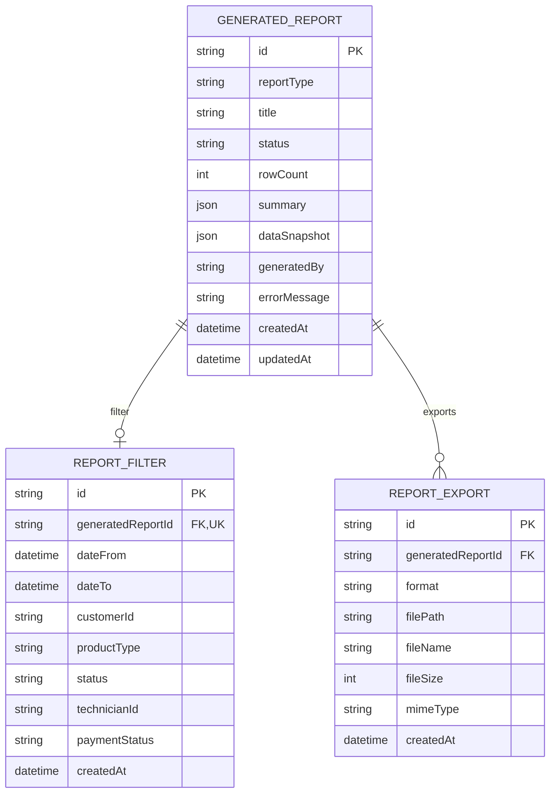
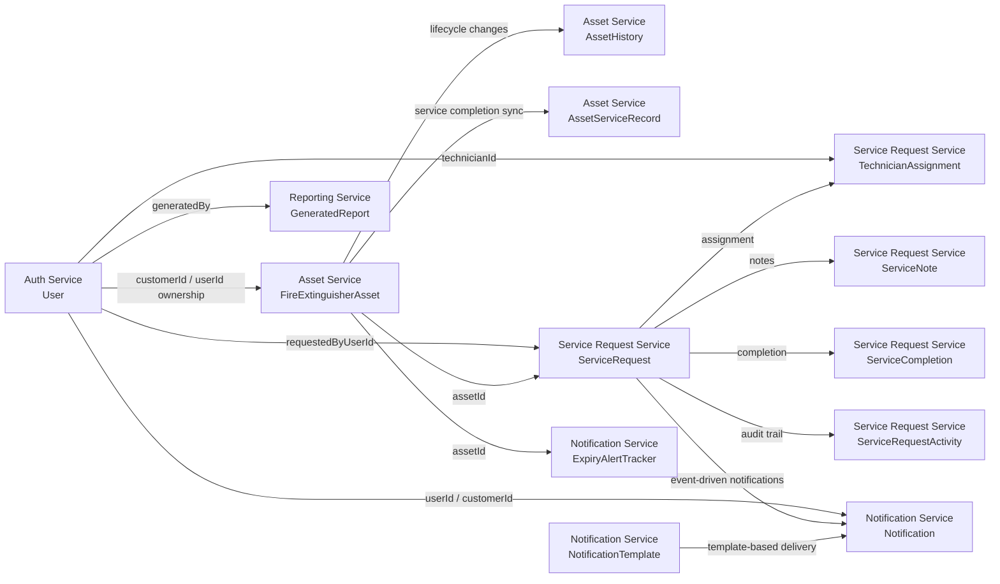

# FEMS ERD Diagrams

This repository uses microservices, so each service owns its own database schema.
The ERDs below are grouped by service to reflect the actual data boundaries.

## Auth Service

## Asset Service

## Service Request Service

## Notification Service

## Reporting Service

## Logical Cross-Service Map

These relationships are application-level references between separate databases, not direct Prisma foreign keys.

